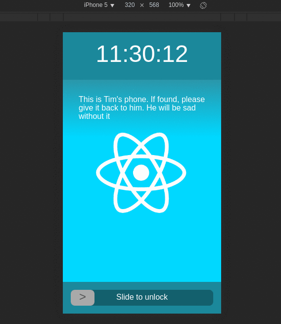

> [kuy](https://twitter.com/suchipi)님이 쓰신 [The Right Way to Test React Components](https://medium.freecodecamp.com/the-right-way-to-test-react-components-548a4736ab22)라는 글의 번역입니다. 본 번역 글은 [원 작자의 허가하](https://medium.com/@suchipi/sure-please-just-do-the-same-things-indicate-that-it-is-translated-from-this-one-with-a-link-51eb96fbbb58)에 작성되어 있습니다.
>
> 번역문이지만 한국어로 읽히기 쉽게 하게 위해 원작자의 **의도가 변하지 않는 선에서** 적극적으로 의역을 하고 있습니다. 반대로 본문에서의 중요하게 다뤄지는 개념들(React의 Component, Prop, State와 같이)은 번역시 오해가 생길 수 있으므로 원문을 그대로 씁니다.
>
> 번역자 : [Junyoung Choi (Rokt33r)](https://github.com/rokt33r)

# React Component를 테스트하기 위한 올바른 방법

<!--# The Right Way to Test React Components-->

지금 React Component를 테스트하기 위한 "올바른" 방법에 대해 많은 혼란이 있습니다. 당신은 모든 테스트를 수작업으로 써야할까요? 아니면 스냅샷만 활용해야 할까요? 어쩌면 둘 다? Prop들도 테스트 할 건가요? State는? 스타일이나 레이아웃은 어떻게 할 건가요?

<!--There’s a lot of confusion right now about the “right” way to test your React components. Should you write all your tests by hand, or only use snapshots, or some of both? Should you test props? State? Styles/Layout?-->

제 생각에는 하나의 "올바른" 방법은 없는 것 같습니다만, 그래도 정말 효과가 있어 조금의 패턴들과 팁들을 찾아 내어 소개드리고 싶습니다.

<!--I don’t think there’s one “right” way, but I’ve found a few patterns and tips that work really well for me that I’d like to share.-->

## 배경: 테스트해 볼 어플리케이션

<!--## Background: The App We’ll Test-->

스마트폰의 잠김화면과 같이 동작하는 `LockScreen` Component를 테스트하고 싶다고 가정합시다. 이 앱은 다음과 같은 것을 합니다:

<!--Suppose you want to test a `LockScreen` component, which behaves like a phone’s lock screen. It:-->

-   현재 시간을 표시한다.
-   유저가 설정한 메세지를 표시할 수 있어야 한다.
-   유저가 설정한 배경 화면을 표시할 수 있어야 한다.
-   밀어서 잠금 해제 위젯을 밑에 둬야한다.

<!---   Shows the current time
-   Can show a user-defined message
-   Can show a user-defined background image
-   Has a slide-to-unlock widget at the bottom-->

아마 이런 모양이 될것입니다:

<!--It looks something like this:-->



[여기](https://suchipi.github.io/react-testing-example-lockscreen)에서 직접 써보실 수 있습니다. 그리고 코드는 [GitHub](https://github.com/suchipi/react-testing-example-lockscreen)에서 찾으실 수 있습니다.

<!--You can try it out [here](https://suchipi.github.io/react-testing-example-lockscreen), and view the code [on GitHub](https://github.com/suchipi/react-testing-example-lockscreen).-->

최상위 레벨의 `App` Component는 다음과 같습니다:

<!--Here’s the code for the top-level `App` component:-->

`App.jsx`

```js
import React from "react";
import LockScreen from "./LockScreen";

export default class App extends React.Component {
  render() {
    return (
      <LockScreen
        wallpaperPath="react_wallpaper.png"
        userInfoMessage="이건 Tim의 전화입니다. 만약 찾으시면 그에게 돌려주세요. 이게 없으면 슬퍼하고 있을거에요."
        onUnlocked={() => alert("열림!")}
      />
    );
  }
}
```

<!--```js
import React from "react";
import LockScreen from "./LockScreen";

export default class App extends React.Component {
  render() {
    return (
      <LockScreen
        wallpaperPath="react_wallpaper.png"
        userInfoMessage="This is Tim's phone. If found, please give it back to him. He will be sad without it"
        onUnlocked={() => alert("unlocked!")}
      />
    );
  }
}
```-->

보다싶이, `LockScreen`은 세가지 Prop들을 받습니다: `wallpaperPath`, `userInfoMessage`, 그리고 `onUnlocked`.

<!--As you can see, `LockScreen` receives three props: `wallpaperPath`, `userInfoMessage`, and `onUnlocked`.-->

`LockScreen`의 코드는 다음과 같습니다:

<!--Here’s the code for `LockScreen`:-->

`LockScreen.jsx`

```js
import React, { PropTypes } from "react";
import ClockDisplay from "./ClockDisplay";
import TopOverlay from "./TopOverlay";
import SlideToUnlock from "./SlideToUnlock";

export default class LockScreen extends React.Component {
  static propTypes = {
    wallpaperPath: PropTypes.string,
    userInfoMessage: PropTypes.string,
    onUnlocked: PropTypes.func,
  };

  render() {
    const {
      wallpaperPath,
      userInfoMessage,
      onUnlocked,
    } = this.props;

    return (
      <div
        style={{
          height: "100%",
          display: "flex",
          justifyContent: "space-between",
          flexDirection: "column",
          backgroundImage: wallpaperPath ? `url(${wallpaperPath})` : "",
          backgroundColor: "black",
          backgroundPosition: "center",
          backgroundSize: "cover",
        }}
      >
        <ClockDisplay />
        {userInfoMessage ? (
          <TopOverlay
            style={{
              padding: "2em",
              marginBottom: "auto",
            }}
          >
            {userInfoMessage}
          </TopOverlay>
        ) : null}
        <SlideToUnlock onSlide={onUnlocked} />
      </div>
    );
  }
}
```

`LockScreen`는 다른 Component들을 불르고 있지만, 우리는  `LockScreen`만 테스트를 할 것이므로, 지금은 여기에만 집중합시다.

<!--`LockScreen` pulls in a few other components, but since we’re only testing `LockScreen`, let’s focus on it right now.-->

## Component Contracts

<!--## Component Contracts-->

`LockScreen`를 테스트 하려면, 우선 그것의 **Contract**가 뭐인지 알아야 합니다. 한 Component의 Contract를 이해하는 것은 React Component의 테스트에서 매우 중요한 부분입니다. Contract는 Component로부터 기대되는 동작과 사용시 어떤한 가정이 이치에 맞는 지를 정의합니다. 분명한 Contract가 없다면, 당신의 Component는 아마 쉽게 이해하기 어려울 것입니다. 테스트를 작성하는 것은 Component의 Contract를 제대로 정의하기 위한 아주 좋은 방법입니다.

> 역자 주: Contract는 비즈니스에서의 계약에 대한 은유로써 본문에선 Component가 **어떻게 표시**되고 **무엇을 해야하는지** 등을 결정하는 **사양(Specification)** 과 같은 의미로 생각하시면 됩니다.
>
> <https://en.wikipedia.org/wiki/Design_by_contract>

<!--In order to test `LockScreen`, you must first understand what its **Contract** is. Understanding a component’s contract is the most important part of testing a React component. A contract defines the expected behavior of your component and what assumptions are reasonable to have about its usage. Without a clear contract, your component may be hard to understand. Writing tests is a great way to formally define your component’s contract.-->

각각의 React Component는 Contract를 정의하는 기능을 적어도 하나는 가지고 있습니다.

<!--Every React component has at least one thing that contributes to the definition of its contract:-->

-   **무엇을 렌더시키는가** (어쩌면 아무것도 안 할 수도 있겟죠)

<!---   **What it renders** (which may be nothing)-->

그리고, 대부분의 Component Contract는 주로 다음 요소들에 영향을 받습니다:

<!--Additionally, most component contracts are affected by these things as well:-->

-   **Component가 받을 props**
-   **Component가 가지는 state**
-   **유저와 상호작용이 일어날 때** Component가 하는 일 (클릭, 드래그, 키보드입력 등)

<!---   The **props the component receives**
-   The **state the component holds** (if any)
-   What the component does when the **user interacts with it** (via clicking, dragging, keyboard input, etc)-->

Component Contract에 덜 영향을 끼치는 것들은 다음과 같습니다:

<!--Some less common things that affect component contracts are:-->

-   **Component가 표시되고있는 context**
-   **Component의 인스턴스 메소드**가 불러와졌을 때, 컴포넌트가 하는 것 (public ref interface)
-   Component 일부 lifecycle에서 일어나는 **Side effects** (componentDidMount, componentWillUnmount, 등)

<!---   The **context the component is rendered in**
-   What the component does when you call **methods on its instance** (public ref interface)
-   **Side effects** that occur as part of the component lifecycle (componentDidMount, componentWillUnmount, etc)-->

여러분의 Component의 Contract를 알기 위해선 다음의 질문에 대해 스스로 답해보셔야 합니다:

<!--To find your component’s contract, ask yourself questions like:-->

-   Component는 무엇을 렌더링하는가?
-   Component는 다양한 상황에 따라 다른 것들을 렌더링 하는가?
-   Prop으로 넘겨준 함수를 Component는 무얼 위해 쓰는가? 그대로 사용하는가? 아니면 또 다른 Component로 넘겨줄 건가? 만약 그대로 사용한다면, 동시에 무엇을 하는가?
-   유저가 Component와 상호작용을 하면 무슨 일이 일어나는가?

<!---   What does my component render?
-   Does my component render different things under different circumstances?
-   When I pass a function as a prop, what does my component use it for? Does it call it, or just give it to another component? If it calls it, what does it call it with?
-   When the user interacts with my component, what happens?-->

## LockScreen의 Contract를 알아보자

<!--## Finding LockScreen's Contract-->

`LockScreen`의 `render` 메소드를 살펴보고, 어디에서 렌더링이 바뀔 수 있는지 코멘트로 추가해보겠습니다. 3항 연산자, If문, Switch문이 단서가 될 것입니다. 이렇게 함으로써 좀 더 쉽게 Contract로 인한 변화를 파악 할 수 있습니다.

<!--Let’s go through `LockScreen`’s `render` method and add comments at places where its behavior can differ. You’ll look for ternaries, if statements, and switch statements as our clues. This will help us find variations in its contract.-->

`LockScreen-render.jsx`

```js
render() {
  const {
    wallpaperPath,
    userInfoMessage,
    onUnlocked,
  } = this.props;

  return (
    <div
      style={{
        height: "100%",
        display: "flex",
        justifyContent: "space-between",
        flexDirection: "column",
        // 만약 wallpaperPath props이 넘겨지면, div의 CSS background-image로 들어갈 것이다.
        // 넘겨지지 않는다면, 빈 문자열이 되어야한다.(= 아무런 스타일도 넣지 않는다.)
        backgroundImage: wallpaperPath ? `url(${wallpaperPath})` : "",
        backgroundColor: "black",
        backgroundPosition: "center",
        backgroundSize: "cover",
      }}
    >
      <ClockDisplay />
      {/*
        만약 userInfoMessage prop이 넘겨지면, TopOverlay를 통해 userInfoMessage를 표시시킨다.
        넘겨지지 않는다면, 여기에 아무것도 렌더링 시키지 않는다.(null)
      */}
      {userInfoMessage ? (
        <TopOverlay
          style={{
            padding: "2em",
            marginBottom: "auto",
          }}
        >
          {userInfoMessage}
        </TopOverlay>
      ) : null}
      <SlideToUnlock onSlide={onUnlocked} />
    </div>
  );
}
```

<!--```js
render() {
  const {
    wallpaperPath,
    userInfoMessage,
    onUnlocked,
  } = this.props;

  return (
    <div
      style={{
        height: "100%",
        display: "flex",
        justifyContent: "space-between",
        flexDirection: "column",
        // If a wallpaperPath prop was passed, then this div's CSS background-image
        // should be a url to that wallpaperPath. Otherwise, it should be an empty
        // string (which means the style should not be set).
        backgroundImage: wallpaperPath ? `url(${wallpaperPath})` : "",
        backgroundColor: "black",
        backgroundPosition: "center",
        backgroundSize: "cover",
      }}
    >
      <ClockDisplay />
      {/*
        If a userInfoMessage prop was passed, render that
        userInfoMessage within a TopOverlay. Otherwise,
        don't render anything here (null).
      */}
      {userInfoMessage ? (
        <TopOverlay
          style={{
            padding: "2em",
            marginBottom: "auto",
          }}
        >
          {userInfoMessage}
        </TopOverlay>
      ) : null}
      <SlideToUnlock onSlide={onUnlocked} />
    </div>
  );
}
```-->

이제 `LockScreen`의 contract를 나타내는 3가지의 Contraint에 대해 알게 되었습니다:

<!--We’ve learned three constraints that describe `LockScreen`'s contract:-->

-   만약 `wallpaperPath` Prop이 넘겨지면, 가장 바깥의 `div`는 그 값이 무엇이든 url(...)로 감싸여져서 `background-image` CSS property를 inline 스타일로 가지게 됩니다.
-   만약 `userInfoMessage` Prop이 넘겨지면, 몇가지 inline 스타일과 함께 `TopOverlay`의 자식으로 넘겨줍니다.
-   만약 `userInfoMessage` Prop이 넘겨지지 않는다면, `TopOverlay`는 렌더링되지 않습니다.

> 역자 주: Constraint는 Contract(사양)에 대한 각각의 항목, 바꿔말하면 세세한 규칙을 의미합니다. 의도적으로 Contract와 Constraint를 혼동하지 않도록 두 단어는 영어 그대로 썻습니다.

<!---   If a `wallpaperPath` prop is passed, the outermost wrapping `div` that the component renders should have a `background-image` CSS property in its inline styles, set to whatever the value of wallpaperPath was, wrapped within url(...).
-   If a `userInfoMessage` prop is passed, it should be passed as children to a `TopOverlay`, which should be rendered with a particular set of inline styles.
-   If a `userInfoMessage` prop is not passed, no `TopOverlay` should be rendered.-->

그리고 Contract에서 몇가지 Contraint은 항상 그대로라는 것을 알 수 있습니다:

<!--You can also find some constraints of the contract that are always true:-->

-   `div`는 무엇이 들어오든 항상 렌더링됩니다. inline 스타일을 가집니다.
-   `ClockDisplay`는 항상 렌더링됩니다. 아무런 Prop도 받지 않습니다.
-   `SlideToUnlock`는 항상 렌더링됩니다. `onUnlocked`이 정의되든 말든 `SlideToUnlock`의 `onSlide` Prop으로 넘겨줍니다.

<!---   A `div` is always rendered, which contains everything else. It has a particular set of inline styles.
-   A `ClockDisplay` is always rendered. It does not receive any props.
-   A `SlideToUnlock` is always rendered. It receives the value of the passed `onUnlocked` prop as its `onSlide` prop, regardless of if it was defined or not.-->

Component의 `propTypes` 역시 Contract를 알기 위한 단서를 찾기 좋은 곳입니다. 여기서 좀 더 많은 Contraint들을 알게 되었습니다:

<!--The component’s `propTypes` are also a good place to look for clues about its contract. Here’s some more constraints I notice:-->

-   `wallpaperPath`는 문자열이며, 선택적으로 주어질 수 있습니다.
-   `userInfoMessage`는 문자열이며, 선택적으로 주어질 수 있습니다.
-   `onUnlocked`는 함수이며, 선택적으로 주어질 수 있습니다.

<!---   `wallpaperPath` is expected to be a string, and is optional.
-   `userInfoMessage` is expected to be a string, and is optional.
-   `onUnlocked` is expected to be a function, and is optional.-->

이런식으로 Component의 Contract를 찾을 수 있습니다. 아마 더 많은 Contraint이 있어야 할 것이고, Production 수준의 코드이면 (품질을 보증하기 위해) 가능한 한 더 많이 찾고 싶으실 겁니다. 이것은 예제이므로 일단 이것들만을 가지고 해봅시다. 여러분들은 언제든지 Contraint들을 더 발견하면 테스트를 늘릴 수 있습니다.

<!--This is a good starting point for our component contract. There may be more constraints within this component’s contract, and in production code you will want to find as many as you can, but for the purposes of this example, let’s just work with these. You can always add tests later if you discover additional constraints.-->

## 무엇이 테스트 할만한 가치가 있나?

<!--## What’s Worth Testing?-->

-   `wallpaperPath`는 문자열이며, 선택적으로 주어질 수 있습니다.
-   `userInfoMessage`는 문자열이며, 선택적으로 주어질 수 있습니다.
-   `onUnlocked`는 함수이며, 선택적으로 주어질 수 있습니다.
-   `div`는 항상 렌더링되며, 모든 것을 담고 있습니다. inline 스타일을 가집니다.
-   `ClockDisplay`는 항상 렌더링됩니다. 아무런 Prop도 받지 않습니다.
-   `SlideToUnlock`는 항상 렌더링됩니다. `onUnlocked`이 정의되든 말든 `SlideToUnlock`의 `onSlide` Prop으로 넘겨줍니다.
-   만약 `wallpaperPath` Prop이 넘겨지면, 가장 바깥의 `div`는 그 값이 무엇이든 `url(...)`로 감싸여져서 `background-image` CSS property를 inline 스타일로 가지게 됩니다.
-   만약 `userInfoMessage` Prop이 넘겨지면, 몇가지 inline 스타일과 함께 `TopOverlay`의 자식으로 넘겨줍니다.
-   만약 `userInfoMessage` Prop이 넘겨지지 않는다면, `TopOverlay`는 렌더링되지 않습니다.

<!---   `wallpaperPath` is expected to be a string, and is optional.
-   `userInfoMessage` is expected to be a string, and is optional.
-   `onUnlocked` is expected to be a function, and is optional.
-   A `div` is always rendered, which contains everything else. It has a particular set of inline styles.
-   A `ClockDisplay` is always rendered. It does not receive any props.
-   A `SlideToUnlock` is always rendered. It receives the value of the passed `onUnlocked` prop as its `onSlide` prop, regardless of if it was defined or not.
-   If a `wallpaperPath` prop is passed, the outermost wrapping div that the component renders should have a `background-image` css property in its inline styles, set to whatever the value of wallpaperPath was, wrapped within url(...).
-   If a `userInfoMessage` prop is passed, it should be passed as children to a `TopOverlay`, which should be rendered with a particular set of inline styles.
-   If a `userInfoMessage` prop is not passed, no `TopOverlay` should be rendered.-->

일부 Contraint은 테스트할 가치가 있지만, 그렇지 않은 것도 있습니다. 저는 **테스트할 가치가 없는 것들**을 3가지 Rules of thumb을 통해 결정합니다:

> 역자 주: Rules of Thumb는 경험상으로 얻어진 만든 규칙들을 의미합니다. 여기선 원작자의 경험상 쓸만한 규칙으로, 이하는 이 Rules of Thumb를 통해 테스트할 Constraint를 결정합니다. 의미상 Contract, Constraint 그리고 Rules of Thumb 모두 규칙으로 번역될 우려가 있으므로 이 역시 원문 그대로 씁니다.

<!--Some of these constraints are worth testing, and others are not. Here are three rules of thumb I use to determine that something is **not worth testing**:-->

1.  테스트 코드에 **실행 코드가 그대로 중복되어** 쓰여져 있는가? 이것은 테스트가 망가지기 쉽게 만듭니다.
2.  테스트 코드의 Assertion이 **이미 다른 라이브러리 코드가 보증하는 (그리고 책임지는) 부분**과 중복되는가? _(가장 중요)_
3.  Component 바깥에서의 시점에서, **이러한 세부항목들이 중요한가? 혹은 그저 내부적인 사정**인가? 이러한 내부적인 사정으로 인한 영향는 Component의 public API를 쓰는 것만으로 설명 될 수 있는가?

<!--1.  Will the test have to **duplicate exactly the application code**? This will make it brittle.
2.  Will making assertions in the test duplicate any behavior that is **already covered by (and the responsibility of) library code**? (Top highlight)
3.  From an outsider’s perspective, **is this detail important, or is it only an internal concern**? Can the effect of this internal detail be described using only the component’s public API?-->

이것들은 그저 Rules of thumb이므로, 어렵다다고 테스트하기 싫다는 변명으로 쓰여지지 않도록 조심하세요. **종종, 테스트하기 어려워 보이는 것들이 테스트에서 가장 중요합니다.** 테스트가 행해지는 코드는 어플리케이션의 다른 나머지 코드까지도 여러 많은 가정들을 잡아 주기 때문에 안정적인 결과물을 만들 수 있습니다.

<!--These are only rules of thumb, so be careful not to use them to justify not testing something just because it’s hard. **Often, things that seem hard to test are the most important to test**, because the code under test is making many assumptions about the rest of the application.-->

<!--원문은 안정적인 결과물이란 표현은 없고 많은 가정을 만들어준다고 적혀있지만, 무리해서 직역할 경우 오히려 원작자의 의도가 파악하기 힘들어질 우려가 있으므로 설명을 추가함-->

그럼 Constraint를 살펴보고 무엇을 테스트할지 말지를 Rules of Thumb를 통해 결정해봅시다. 먼저 처음 3개부터 시작합시다:

<!--Let’s go through our constraints and use these rules of thumb to determine which need to be tested. Here’s the first three:-->

-   `wallpaperPath`는 문자열이며, 선택적으로 주어질 수 있습니다.
-   `userInfoMessage`는 문자열이며, 선택적으로 주어질 수 있습니다.
-   `onUnlocked`는 함수이며, 선택적으로 주어질 수 있습니다.

<!---   `wallpaperPath` is expected to be a string, and is optional.
-   `userInfoMessage` is expected to be a string, and is optional.
-   `onUnlocked` is expected to be a function, and is optional.-->

이 Constraint들은 React의 `PropTypes` 메커니즘이 신경쓰는 부분입니다. 그러므로, 이걸 테스트로 만드는건 Rule #2(이미 다른 라이브러리가 보증하고 있음)를 위배하게 됩니다. 고로, **저는 Prop의 타입들**은 테스트 하지 않습니다. 저는, 종종 테스트들은 문서를 겸할 수 있기에, 가끔 Rule #2를 위배하더라도 실행코드가 어떤 타입을 받을지 알기 어렵다면 테스트를 쓰기도 합니다. 하지만, `propTypes`는 충분히 좋고 읽기도 쉬우므로 하지 않습니다.

<!--These constraints are a concern of React’s `PropTypes` mechanism, and so writing tests around prop types fails rule #2 (already covered by library code). As such, **I don’t test prop types**. Because tests often double as documentation, I might decide to test something that failed rule #2 if the application code didn’t document the expected types very well, but `propTypes` are already nice and human-readable.-->

다음 Constraint를 봅시다:

<!--Here’s the next constraint:-->

-   `div`는 항상 렌더링되며, 모든 것을 담고 있습니다. inline 스타일을 가집니다.

<!---   A `div` is always rendered, which contains everything else. It has a particular set of inline styles.-->

이건 3가지의 Constraint들로 나누어 질 수 있습니다.

<!--This can be broken down into three constraints:-->

-   `div`는 항상 렌더링 됩니다.
-   `div`는 렌더링되는 다른 모든 것들을 담고 있습니다.
-   `div`는 inline 스타일을 가집니다.

<!---   A `div` is always rendered.
-   The rendered `div` contains everything else that gets rendered.
-   The rendered `div` has a particular set of inline styles.-->

처음 2개의 Constraint들은 Rules of Thumb를 위반하지 않으므로, 우리는 이것들을 **테스트할 것입니다**. 하지만, 3번째를 봅시다.

<!--The first two constraints that we broke this down into do not fail any of our rules of thumb, so **we will test them**. However, let’s look at the third one.-->

다른 constraint가 다루고 있는 `background-image`를 제외하고, `div`는 다음의 스타일들을 가집니다:

<!--Ignoring the background-image property that is covered by another constraint, the wrapping `div` has these styles:-->

```js
height: "100%",
display: "flex",
justifyContent: "space-between",
flexDirection: "column",
backgroundColor: "black",
backgroundPosition: "center",
backgroundSize: "cover",
```

만약 이 스타일들이 있는지 테스트를 하려 한다면, 유효한 Assertion를 위해 각 스타일의 값을 _있는 그대로_ 테스트해야 할 것입니다. 고로 Assertion들은 다음과 같이 됩니다:

<!--If we wrote a test that these styles were on the div, we would have to test the value of each style _exactly_ in order to make useful assertions. So our assertions might be something like:-->

-   `div`는 `height` 스타일은 `100%`의 값을 가진다.
-   `div`는 `display` 스타일을 `flex`로 가진다.
-   …다른 스타일들도 똑같이 한다.

<!---   The wrapping div should have a height style property of 100%
-   The wrapping div should have a display style property of flex
-   …And so on for each style property-->

간결한 테스트를 위해 [`toMatchObject`](https://facebook.github.io/jest/docs/expect.html#tomatchobjectobject)같은 걸 쓰고 있더라도, 이건 실행 코드의 스타일과 중복되는데다 망가지기 쉽게 됩니다. 만약 다른 스타일을 추가한다해도, 똑같은 코드를 테스트에도 넣어야 할겁니다. 또한, Component의 행동이 바뀌지 않더라도, 스타일을 약간 수정하게되면 테스트에서의 스타일 역시 그대로 수정되어져야 합니다. 그러므로 이 Constraint는 Rule #1를 위반하고 있습니다.(실행 코드와 중복됨; 망가지기 쉬움) 이런 이유로, **저는 런타임에서 변화가 일어나지 않는 한 inline 스타일 테스트를 하지 않습니다**.

<!--Even if we used something like [`toMatchObject`](https://facebook.github.io/jest/docs/expect.html#tomatchobjectobject) to keep this test succinct, this would duplicate the same styles in the application code, and be brittle. If we added another style, we would have to put the exact same code in our test. If we tweaked a style, we would have to tweak it in our test, even though the component’s behavior may not have changed. Therefore, this constraint fails rule #1 (duplicates application code; brittle). For this reason, **I don’t test inline styles, unless they can change at runtime**.-->

종종 "이것은 이것이 하는 걸 한다"나 "이것은 실행 코드에서 하는 걸 그대로 한다" 같은 코드를 쓰신다면, 이러한 테스트들은 불필요 하거나 너무 명백한 겁니다.

<!--Often, if you are writing a test that amounts to “it does what it does”, or “it does exactly this, which happens to be duplicated in the application code”, then the test is either unnecessary or too broad.-->

이제 그 다음 2개의 Constraint를 봅시다:

<!--Here’s the next two constraints:-->

-   `ClockDisplay`는 항상 렌더링됩니다. 아무런 Prop도 받지 않습니다.
-   `SlideToUnlock`는 항상 렌더링됩니다. `onUnlocked`이 정의되든 말든 `SlideToUnlock`의 `onSlide` Prop으로 넘겨줍니다.

<!---   A `ClockDisplay` is always rendered. It does not receive any props.
-   A `SlideToUnlock` is always rendered. It receives the value of the passed `onUnlocked` prop as its `onSlide` prop, regardless of if it was defined or not.-->

이것들은 다음과 같이 나뉠 수 있습니다:

<!--These can be broken down into:-->

-   `ClockDisplay`는 항상 렌더링 됩니다.
-   렌더링된 `ClockDisplay`는 아무런 Prop도 받지 않습니다.
-   `SlideToUnlock`는 항상 렌더링 됩니다.
-   `onUnlocked` Prop이 정의되었으면, 렌더링된 `SlideToUnlock`은 `onSlide` Prop으로 `onUnlocked`를 받습니다.
-   `onUnlocked` Prop이 정의되지 않았으면, 렌더링된 `SlideToUnlock`은 `onSlide` Prop 역시 `undefined`를 받습니다.

<!---   A `ClockDisplay` is always rendered.
-   The rendered `ClockDisplay` does not receive any props.
-   A `SlideToUnlock` is always rendered.
-   When the passed `onUnlocked` prop is defined, the rendered `SlideToUnlock` receives that prop’s value as its `onSlide` prop.
-   When the passed `onUnlocked` prop is undefined, the rendered `SlideToUnlock`'s `onSlide` prop should also be set to `undefined`.-->

이러한 Constraint들은 2가지 카테고리로 정리됩니다: "어떤 Component가 렌더링된다", 그리고 "렌더링된 Component는 이러한 Prop을 받는다". 이것들은 어떻게 여러분의 Component가 다른 Component들과 상호작용을 하는 지를 설명하기 때문에, **두가지 모두 테스트가 필요할 만큼 중요합니다**. 고로, 우리는 이러한 Constraint들을 모두 테스트 할 겁니다.

<!--These constraints fall into two categories: “Some composite component is rendered”, and “the rendered component receives these props”. **Both are very important to test**, as they describe how your component interacts with other components. We will test all of these constraints.-->

다음 Constraint를 봅시다:

<!--The next constraint is:-->

-   만약 `wallpaperPath` Prop이 넘겨지면, 가장 바깥의 `div`는 그 값이 무엇이든 url(...)로 감싸여져서 `background-image` CSS property를 inline 스타일로 가지게 됩니다.

<!--If a `wallpaperPath` prop is passed, the outermost wrapping div that the component renders should have a `background-image` css property in its inline styles, set to whatever the value of `wallpaperPath` was, wrapped within `url(...)`.-->

어쩌면 여러분들은, inline 스타일이기 때문에, 테스트 할 필요가 없다고 생각할지도 모릅니다. 하지만, **`background-image`는 `wallpaperPath` Prop에 따라 바뀌므로 테스트 될 필요가 있습니다**. 만약 테스트하지 않는다면, Component의 Public interface의 일부인 `wallpaperPath` Prop의 영향에대한 테스트는 아무것도 없게 됩니다. Public interface는 항상 테스트 되어져야만 합니다.

<!--You may think that, because this is an inline style, we do not need to test it. However, **because the value of `background-image` can change based on the `wallpaperPath` prop, it needs to be tested.** If we did not test it, then there would be no test around the effect of the `wallpaperPath` prop, which is part of the public interface of this component. You should always test your public interface.-->

마지막으로 남은 2개의 Constraint들을 봅시다:

<!--The final two constraints are:-->

-   만약 `userInfoMessage` Prop이 넘겨지면, 몇가지 inline 스타일과 함께 `TopOverlay`의 자식으로 넘겨줍니다.
-   만약 `userInfoMessage` Prop이 넘겨지지 않는다면, `TopOverlay`는 렌더링되지 않습니다.

<!---   If a `userInfoMessage` prop is passed, it should be passed as children to a `TopOverlay`, which should be rendered with a particular set of inline styles.
-   If a `userInfoMessage` prop is not passed, no `TopOverlay` should be rendered.-->

이것들도 다음과 같이 나뉠 수 있습니다:

<!--These can be broken down into:-->

-   만약 `userInfoMessage` Prop이 넘겨지면, `TopOverlay`를 렌더링합니다.
-   만약 `userInfoMessage` Prop이 넘겨지면, 그것은 `TopOverlay`의 children으로 넘겨져야 합니다.
-   만약 `userInfoMessage` Prop이 넘겨지면, 렌더링된 `TopOverlay`는 inline 스타일을 가집니다.
-   만약 `userInfoMessage` Prop이 넘겨지지 않는다면, `TopOverlay`는 렌더링되지 않습니다.

<!---   If a `userInfoMessage` prop is passed, a `TopOverlay` should be rendered.
-   If a `userInfoMessage` prop is passed, its value should be passed as children to the rendered `TopOverlay`.
-   If a `userInfoMessage` prop is passed, the rendered `TopOverlay` should be rendered with a particular set of inline styles.
-   If a `userInfoMessage` prop is not passed, no `TopOverlay` should be rendered.-->

첫번째과 4번째 Constraint는(`TopOverlay`은 렌더링 된다/되지 않는다) **무엇을 렌더링할지를 말하고 있으므로, 테스트합니다**.

<!--The first and fourth constraints (a `TopOverlay` should/should not be rendered) **describe what we render, so we will test them.**-->

두번째 Constraint는 `TopOverlay`가 `userInfoMessage`의 값을 Prop으로 받고 있는지를 확인합니다. **이 역시 렌더링된 Component가 받을 Prop에 대한 것이므로 테스트할 만큼 중요합니다. 고로, 이것도 테스트합니다**.

<!--The second constraint verifies that the `TopOverlay` receives a particular prop based on the value of `userInfoMessage`. **It is important to write tests around the props that rendered components receive, so we will test it.**-->

3번째 Constraint도 `TopOverlay`가 받는 특정 Prop을 확인하기 때문에, 어쩌면 테스트해야 한다고 생각하셨을 수도 있습니다. 하지만, 이 Prop은 그저 inline 스타일입니다. Prop이 넘겨졌는지 확인하는 것은 중요하지만, inline 스타일에 대한 테스트를 만드는건 망가지기 쉽고 실행코드와 중복됩니다. (Rule #1에 위배됩니다) 넘겨진 Prop들을 확인하는 건 중요하기 때문에, Rule #1만 생각하면 테스트를 해야할지 말지가 애매해질 수 있습니다; 다행스럽게도 제가 Rule #3를 말한 이유가 여기에 있습니다. 다시 상기하면:

<!--The third constraint verifies that `TopOverlay` receives a particular prop, so you might think that we should test it. However, this prop is just some inline styles. Asserting that props are passed is important, but making assertions about inline styles is brittle and duplicates application code (fails rule #1). Because it’s important to test passed props, it’s not clear whether this should be tested just by looking at rule #1 alone; luckily, that’s why I have rule #3. As a reminder, it’s:-->

> Component 바깥에서의 시점에서, **이러한 세부항목들이 중요한가? 혹은 그저 내부적인 사정**인가? 이러한 내부적인 사정으로 인한 영향는 Component의 public API를 쓰는 것만으로 설명 될 수 있는가?

<!--
> From an outsider’s perspective, **is this detail important, or is it only an internal concern**? Can the effect of this internal detail be described using only the component’s public API?-->

테스트를 쓸 때, 저는 가능한 **Component의 public API만을 테스트**합니다. (어플리케이션 API가 가지는 Side effects를 포함해서) **이 Component의 레이아웃은 public API로부터 아무런 영향을 받지 않습니다; 이것은 CSS엔진이 신경 쓸 일입니다.** 이로 인해 Rule #3까지 위반하게 됩니다. 결국 Rule #1와 Rule #3에 위배되므로, TopOverlay가 Prop을 받는지를 확인하는 것이 일반적으로 중요하지만, **테스트 하지 않습니다**.

<!--When I write component tests, I **only test the public API of the component** (including side effects that API has on the application) where possible. **The exact layout of this component is not impacted by this component’s public API; it is a concern of the CSS engine.** Because of this, this constraint fails rule #3. Because it fails rule #1 and rule #3, **we will not test this constraint**, even though it verifies that TopOverlay receives a prop, which is normally important.-->

마지막 Constraint는 테스트할지 말지 결정하기 어려웠습니다. 결국 여러분이 어떤 부분이 테스트할만큼 중요한지에 달려있습니다; 이러한 Rules of Thumb는 그저 가이드라인일 뿐입니다.

<!--It was hard to determine whether that final constraint should be tested or not. Ultimately, it is up to you to decide which parts are important to test; these rules of thumb I use are only guidelines.-->

이제 우린 모든 Constraint들을 확인해보았고, 무엇을 테스트할건지 알게 되었습니다. 여기서 다시 한번 리스트를 보여드리겠습니다:

<!--Now we’ve gone through all of our constraints, and know which ones we are going to write tests for. Here they are:-->

-   `div`는 항상 렌더링 됩니다.
-   `div`는 렌더링되는 다른 모든 것들을 담고 있습니다.
-   `ClockDisplay`는 항상 렌더링 됩니다.
-   렌더링된 `ClockDisplay`는 아무런 Prop도 받지 않습니다.
-   `SlideToUnlock`는 항상 렌더링 됩니다.
-   `onUnlocked` Prop이 정의되었으면, 렌더링된 `SlideToUnlock`은 `onSlide` Prop으로 `onUnlocked`를 받습니다.
-   `onUnlocked` Prop이 정의되지 않았으면, 렌더링된 `SlideToUnlock`은 `onSlide` Prop 역시 `undefined`를 받습니다.
-   만약 `wallpaperPath` Prop이 넘겨지면, 가장 바깥의 `div`는 그 값이 무엇이든 url(...)로 감싸여져서 `background-image` CSS property를 inline 스타일로 가지게 됩니다.
-   만약 `userInfoMessage` Prop이 넘겨지면, `TopOverlay`를 렌더링합니다.
-   만약 `userInfoMessage` Prop이 넘겨지면, 그것은 `TopOverlay`의 children으로 넘겨져야 합니다.
-   만약 `userInfoMessage` Prop이 넘겨지지 않는다면, `TopOverlay`는 렌더링되지 않습니다.

<!---   A `div` is always rendered.
-   The rendered `div` contains everything else that gets rendered.
-   A `ClockDisplay` is always rendered.
-   The rendered `ClockDisplay` does not receive any props.
-   A `SlideToUnlock` is always rendered.
-   When the passed `onUnlocked` prop is defined, the rendered `SlideToUnlock` receives that prop’s value as its `onSlide` prop.
-   When the passed `onUnlocked` prop is `undefined`, the rendered `SlideToUnlock`'s `onSlide` prop should also be set to `undefined`.
-   If a `wallpaperPath` prop is passed, the outermost wrapping div that the component renders should have a `background-image` css property in its inline styles, set to whatever the value of `wallpaperPath` was, wrapped within `url(...)`.
-   If a `userInfoMessage` prop is passed, a `TopOverlay` should be rendered.
-   If a `userInfoMessage` prop is passed, its value should be passed as children to the rendered `TopOverlay`.
-   If a `userInfoMessage` prop is not passed, no `TopOverlay` should be rendered.-->

Constraint들을 세세하게 살펴봄으로써, 많은 수의 Constraint를 여러 작은 Constraint들로 나누었습니다. **이건 정말 좋아요!** 이제 테스트 코드를 쓰기가 더욱 쉬워질 겁니다.

<!--By examining our constraints and putting them to scrutiny, we broke many of them down into multiple, smaller constraints. **This is great!** This will make it easier to write our test code.-->

## 테스트 보일러플레이트 준비하기

<!--## Setting Up Some Test Boilerplate-->

Component테스트를 위한 준비를 해봅시다. 저는 [enzyme](http://airbnb.io/enzyme/)와 함께 [Jest](https://facebook.github.io/jest/)를 쓸겁니다. Jest는 [React와 매우 잘 맞고](https://facebook.github.io/jest/docs/tutorial-react.html) [create-react-app](https://github.com/facebookincubator/create-react-app)으로 만들어진 어플리케이션에도 포함된 테스트러너입니다. 그래서 어쩌면 여러분들은 이미 사용할 준비가 되어있을 수도 있습니다. Enzyme는 브라우저와 Node환경에서 동작하는 믿을 만한 React 테스트 라이브러리입니다.

<!--Let’s start scaffolding out a test for this component. I will be using [Jest](https://facebook.github.io/jest/) with [enzyme](http://airbnb.io/enzyme/) in my tests. Jest [works great with React](https://facebook.github.io/jest/docs/tutorial-react.html) and is also the test runner included in apps created with [create-react-app](https://github.com/facebookincubator/create-react-app), so you may already be set up to use it. Enzyme is a mature React testing library that works in both node and the browser.-->

비록 저는 Jest와 enzyme를 사용하지만, 여기서 쓰인 개념들은 어떤 테스트 환경에서도 적용시키실 수 있을 겁니다.

<!--Even though I’m using Jest and enzyme in my tests, you can apply the concepts here to almost any test configuration.-->

`LockScreen.test.jsx`

```js
import React from "react";
import { mount } from "enzyme";
import LockScreen from "./LockScreen";

describe("LockScreen", () => {
  let props;
  let mountedLockScreen;
  const lockScreen = () => {
    if (!mountedLockScreen) {
      mountedLockScreen = mount(
        <LockScreen {...props} />
      );
    }
    return mountedLockScreen;
  }

  beforeEach(() => {
    props = {
      wallpaperPath: undefined,
      userInfoMessage: undefined,
      onUnlocked: undefined,
    };
    mountedLockScreen = undefined;
  });

  // 모든 테스트들은 여기에 쓰여질 것입니다.
});
```

<!--```js
import React from "react";
import { mount } from "enzyme";
import LockScreen from "./LockScreen";

describe("LockScreen", () => {
  let props;
  let mountedLockScreen;
  const lockScreen = () => {
    if (!mountedLockScreen) {
      mountedLockScreen = mount(
        <LockScreen {...props} />
      );
    }
    return mountedLockScreen;
  }

  beforeEach(() => {
    props = {
      wallpaperPath: undefined,
      userInfoMessage: undefined,
      onUnlocked: undefined,
    };
    mountedLockScreen = undefined;
  });

  // All tests will go here
});
```-->

조금 큰 보일러플레이트가 되었네요. 뭘 하고 있는지 설명해드릴게요:

<!--This is a lot of boilerplate. Let me explain what I’ve set up here:-->

-   `let`으로 `props`와 `mountedLockScreen`를 설정합니다. 이로써 `describe`함수 안이면 어디에서든 부를 수 있습니다.
-   **`lockScreen` 함수** 역시 `describe` 안 어디에서든 부를 수 있습니다. 이것은 `mountedLockScreen` 변수에 LockScreen에 Prop와 함꼐 Mount해주고, 이미 Mount된 것을 돌려줍니다. 이 함수는 enzyme ReactWrapper를 리턴합니다. 이건 매 테스트마다 사용할 겁니다.
-   `beforeEach`는 `props`와 `mountedLockScreen`을 매 테스트마다 초기화시킵니다. 하지 않을 경우, 한 테스트의 상태가 다른 테스트에 영향을 줄 수 있습니다. 여기에 `mountedLockScreen`를 `undefined`로 설정함으로써, 다음 테스트가 실행될 때, `lockScreen`을 부르면 매번 새로운 `LockScreen`이 `props`와 함께 Mount될겁니다.

<!---   I create `let` bindings for `props` and `mountedLockScreen`, so that those variables will be available to everything within the `describe` function.
-   I create a **`lockScreen` function** that is available anywhere within the `describe` function, that uses the `mountedLockScreen` variable to either mount a LockScreen with the current props or return the one that has already been mounted. This function returns an enzyme ReactWrapper. We will use it in every test.
-   I set up a `beforeEach` that resets the `props` and `mountedLockScreen` variables before every test. Otherwise, state from one test would leak into another. By setting `mountedLockScreen` to `undefined` here, when the next test runs, if it calls `lockScreen`, a new `LockScreen` will be mounted with the current `props`.-->

이 보일러플레이트는 Component 하나를 테스트하기엔 많아보일지도 모릅니다만, Component를 Mount하기 전에 추가적으로 Props를 준비해 줄 수 있습니다. 이는 테스트가 Dry하도록 도와줍니다. 저는 이것을 모든 Component 테스트에 사용하고, 여러분들에게도 유용하길 빕니다; 유용성은 이제 테스트 케이스들을 써볼 수록 더욱 확실하게 알게 되실 겁니다.

<!--This boilerplate may seem like a lot just to test a component, but it lets us build up our props incrementally before we mount our component, which will help keep our tests dry. I use it for all of my component tests, and I hope you will find it useful; its utility will become more apparent as we write the test cases.-->

> 역자 주: Dry한 테스트는 다른 외부 요인들이 통제된 테스트를 의미합니다.
>
> Prop들이 초기화되지 않는다면 앞서한 테스트에 따라 결과가 바뀔 수 있습니다. 하지만 초기화를 시켜준다면 앞서 어떤 테스트가 행해지든 지금 테스트에는 아무런 영향이 없게 되므로 신뢰성 있는 테스트를 하는게 가능해집니다. 이를 Dry 테스트라고 합니다.

## 테스트를 써보자!

<!--## Writing the Tests!-->

Constraint목록을 보며 하나씩 테스트를 추가해 봅시다. 각각의 테스트는 보일러플레이트의 `// All tests will go here` 코멘트 뒤로 추가되는 형식으로 쓰여져나갈 것입니다.

<!--Let’s go through our list of constraints and add a test for each. Every test will be written such that it can be inserted at the `// All tests will go here` comment in the boilerplate.-->

-   `div`는 항상 렌더링 됩니다.

<!---   A `div` is always rendered.-->

`LockScreen.test.jsx`

```js
it("always renders a div", () => {
  const divs = lockScreen().find("div");
  expect(divs.length).toBeGreaterThan(0);
});
```

-   `div`는 렌더링되는 다른 모든 것들을 담고 있습니다.

<!---   The rendered `div` contains everything else that gets rendered.-->

```js
describe("the rendered div", () => {
  it("contains everything else that gets rendered", () => {
    const divs = lockScreen().find("div");
    // .find를 사용하실 때, enzyme는 노드들을 차례로 나열해 줍니다.
    // 여기서 바깥쪽부터 읽어오기 때문에 .first()를 사용하면
    // 가장 바깥쪽의 div를 불러올 수 있습니다.
    const wrappingDiv = divs.first();

    // Enzyme는 .children()를 쓰면 가장 바깥쪽의 Node를 생략해줍니다.
    // 조금 어려울지 모르겠지만, 이것으로 wrappingDiv가 다른 모든
    // Component를 가지고 있는지 확인 할 수 있습니다.
    expect(wrappingDiv.children()).toEqual(lockScreen().children());
  });
});
```

<!--```js
describe("the rendered div", () => {
  it("contains everything else that gets rendered", () => {
    const divs = lockScreen().find("div");
    // When using .find, enzyme arranges the nodes in order such
    // that the outermost node is first in the list. So we can
    // use .first() to get the outermost div.
    const wrappingDiv = divs.first();

    // Enzyme omits the outermost node when using the .children()
    // method on lockScreen(). This is annoying, but we can use it
    // to verify that wrappingDiv contains everything else this
    // component renders.
    expect(wrappingDiv.children()).toEqual(lockScreen().children());
  });
});
```-->

-   `ClockDisplay`는 항상 렌더링 됩니다.

<!---   A `ClockDisplay` is always rendered.-->

```js
it("always renders a `ClockDisplay`", () => {
  expect(lockScreen().find(ClockDisplay).length).toBe(1);
});
```

-   렌더링된 `ClockDisplay`는 아무런 Prop도 받지 않습니다.

<!---   The rendered `ClockDisplay` does not receive any props.-->

```js
describe("rendered `ClockDisplay`", () => {
  it("does not receive any props", () => {
    const clockDisplay = lockScreen().find(ClockDisplay);
    expect(Object.keys(clockDisplay.props()).length).toBe(0);
  });
});
```

-   `SlideToUnlock`는 항상 렌더링 됩니다.

<!---   A `SlideToUnlock` is always rendered.-->

```js
it("always renders a `SlideToUnlock`", () => {
  expect(lockScreen().find(SlideToUnlock).length).toBe(1);
});
```

여기까지 모든 Constraint들은 항상 참이 되는 것들이므로 비교적 테스트를 만들기가 쉬웠습니다. 그렇지만, 나머지 Constraint들은 "만약 ... 한다면" 같은 조건이나 때와 함께합니다. 이러한 것들은 조건적으로 참이 되므로 `beforeEach`와 함께 2개의 `describe`를 준비할 겁니다.

<!--All of the constraints thus far have been things that are always true, so their tests were relatively simple to write. However, the remaining constraints begin with words like “If” and “When”. These are clues that they are conditionally true, and so we will pair `describe` with `beforeEach` to test them. This is where all that testing boilerplate we wrote earlier comes in handy.-->

-   `onUnlocked` Prop이 정의되었으면, 렌더링된 `SlideToUnlock`은 `onSlide` Prop으로 `onUnlocked`를 받습니다.
-   `onUnlocked` Prop이 정의되지 않았으면, 렌더링된 `SlideToUnlock`은 `onSlide` Prop 역시 `undefined`를 받습니다.

<!---   When the passed `onUnlocked` prop is defined, the rendered `SlideToUnlock` receives that prop’s value as its `onSlide` prop.
-   When the passed `onUnlocked` prop is `undefined`, the rendered `SlideToUnlock`'s `onSlide` prop should also be set to `undefined`.-->

```js
describe("when `onUnlocked` is defined", () => {
  beforeEach(() => {
    props.onUnlocked = jest.fn();
  });

  it("sets the rendered `SlideToUnlock`'s `onSlide` prop to the same value as `onUnlocked`'", () => {
    const slideToUnlock = lockScreen().find(SlideToUnlock);
    expect(slideToUnlock.props().onSlide).toBe(props.onUnlocked);
  });
});

describe("when `onUnlocked` is undefined", () => {
  beforeEach(() => {
    props.onUnlocked = undefined;
  });

  it("sets the rendered `SlideToUnlock`'s `onSlide` prop to undefined'", () => {
    const slideToUnlock = lockScreen().find(SlideToUnlock);
    expect(slideToUnlock.props().onSlide).not.toBeDefined();
  });
});
```

어떤 조건에서만 일어나는 동작을 묘사할 때, 그 조건에 대한 설명을 describe에 넣어줍니다. 그리고, beforeEach를 통해 그 조건을 설정해줍니다.

<!--When we need to describe behavior that only occurs within a certain condition, we can describe that condition, and then use beforeEach within that describe to set that condition up.-->

> 역자 주: `describe`에는 테스트하려는 조건에 대한 얘기가, `it`은 그 조건에서 어떤 결과가 얻어질지에 대한 설명이 들어가있습니다. 테스트 코드는 영어 문법으로 자연스럽게 읽히기에 일부러 번역하지 않았지만, 한국어로 쓰면 다음과 같이 됩니다.
>
> ```js
> describe("`onUnlocked` Prop이 정의되었으면", () => {
>   beforeEach(() => {
>     props.onUnlocked = jest.fn();
>   });
>
>   it("렌더링된 `SlideToUnlock`은 `onSlide` Prop으로 `onUnlocked`를 받습니다.", () => {
>     const slideToUnlock = lockScreen().find(SlideToUnlock);
>     expect(slideToUnlock.props().onSlide).toBe(props.onUnlocked);
>   });
> });
>
> describe("`onUnlocked` Prop이 정의되지 않았으면", () => {
>   beforeEach(() => {
>     props.onUnlocked = undefined;
>   });
>
>   it("렌더링된 `SlideToUnlock`은 `onSlide` Prop 역시 `undefined`를 받습니다.", () => {
>     const slideToUnlock = lockScreen().find(SlideToUnlock);
>     expect(slideToUnlock.props().onSlide).not.toBeDefined();
>   });
> });
> ```

-   만약 `wallpaperPath` Prop이 넘겨지면, 가장 바깥의 `div`는 그 값이 무엇이든 `url(...)`로 감싸여져서 `background-image` CSS property를 inline 스타일로 가지게 됩니다.

<!---   If a `wallpaperPath` prop is passed, the outermost wrapping div that the component renders should have a `background-image` CSS property in its inline styles, set to whatever the value of `wallpaperPath` was, wrapped within `url(...)`.-->

```js
describe("when `wallpaperPath` is passed", () => {
  beforeEach(() => {
    props.wallpaperPath = "some/image.png";
  });

  it("applies that wallpaper as a background-image on the wrapping div", () => {
    const wrappingDiv = lockScreen().find("div").first();
    expect(wrappingDiv.props().style.backgroundImage).toBe(`url(${props.wallpaperPath})`);
  });
});
```

-   만약 `userInfoMessage` Prop이 넘겨지면, `TopOverlay`를 렌더링합니다.
-   만약 `userInfoMessage` Prop이 넘겨지면, 그것은 `TopOverlay`의 children으로 넘겨져야 합니다.

<!---   If a `userInfoMessage` prop is passed, a `TopOverlay` should be rendered.
-   If a `userInfoMessage` prop is passed, its value should be passed as children to the rendered `TopOverlay`.-->

```js
describe("when `userInfoMessage` is passed", () => {
  beforeEach(() => {
    props.userInfoMessage = "This is my favorite phone!";
  });

  it("renders a `TopOverlay`", () => {
    expect(lockScreen().find(TopOverlay).length).toBe(1);
  });

  it("passes `userInfoMessage` to the rendered `TopOverlay` as `children`", () => {
    const topOverlay = lockScreen().find(TopOverlay);
    expect(topOverlay.props().children).toBe(props.userInfoMessage);
  });
});
```

-   만약 `userInfoMessage` Prop이 넘겨지지 않는다면, `TopOverlay`는 렌더링되지 않습니다.

<!---   If a `userInfoMessage` prop is _not_ passed, no `TopOverlay` should be rendered.-->

```js
describe("when `userInfoMessage` is undefined", () => {
  beforeEach(() => {
    props.userInfoMessage = undefined;
  });

  it("does not render a `TopOverlay`", () => {
    expect(lockScreen().find(TopOverlay).length).toBe(0);
  });
});
```

이걸로 모든 Constraint의 테스트가 완성되었습니다! 최종 테스트 파일은 [여기](https://gist.github.com/suchipi/8f8d7de60e8e4ae48153db0c36133e63)에서 확인하실 수 있습니다.

<!--That’s all of our constraints! You can view the final test file [here](https://gist.github.com/suchipi/8f8d7de60e8e4ae48153db0c36133e63).-->

## "이건 내 일이 아닌데"

<!--## “Not My Job”-->

글 처음의 Gif을 보여드렸을 때, 여러분은 테스트들이 다음과 같이 완성될거라 예상하셨던 분들이 있으셨을 겁니다:

<!--When looking at the animated gif at the beginning of the article, you may have expected our test cases to end up as something like:-->

-   유저가 밀어서 잠금해제를 드래그 오른쪽 끝까지 하면, unlock 콜백이 불러진다.
-   드래그하는 도중에 핸들을 놓아버리면, 핸들은 원래 위치로 돌아가는 애니메이션을 보여준다.
-   스크린 최상단의 시계는 언제나 현재 시간을 보여준다.

<!---   When the user drags the slide-to-unlock handle all the way to the right, the unlock callback is called
-   If the user drags the slide-to-unlock handle partway to the right and then releases it, the handle is animated back to its original position
-   The clock at the top of the screen should always show the current time-->

이러한 생각들은 자연스러운 겁니다. 어플리케이션의 전체적인 시점에서 보면 매우 당연한 것들입니다.

<!--This intuition is natural. From an application perspective, these are some of the most noticeable features.-->

하지만 우리는 이에 대해 아무런 테스트도 쓰지 않았습니다. 왜냐고요? 이건 **`LockScreen`이 신경쓸 것**이 아니니까요.

<!--However, we didn’t end up writing tests for any of that functionality. Why? They were **not the concern of `LockScreen`**.-->

React Coponent가 재사용 가능한건, Unit 테스트들과 자연스럽게 어울릴 수 있기 때문입니다. 우리가 그리고 Unit 테스트를 할때, **해당 Unit이 신경써야 할 것만 테스트 하셔야 됩니다**. React Component 테스트를 할 땐 숲을 보는 것보다 각각의 나무를 신경쓰시는게 더 좋습니다.

<!--Because React components are reusable units, unit tests are a natural fit for them. And when unit testing, **you should only test what your actual unit cares about**. It is better to see the trees than the forest when writing React component tests.-->

**대부분의 React Component들이 신경써야 할 것들**을 설명하는 컨닝 페이퍼를 드리겠습니다:

<!--Here is a handy cheat sheet that outlines **the concerns of most React components:**-->

-   받은 Prop으로 뭘 할건가?
-   어떤 Component들을 렌더링해야하나? 렌더링된 Component들에겐 무엇을 넘겨주어야 하는가?
-   State를 가질 필요가 있나? 혹시 그렇다면, 새 Prop을 받았을 때 초기화 시켜야 하는가? 언제 State를 업데이트 해야하나?
-   만약 해당 Component나 Child Component로 넘겨준 Callback이 유저와 상호작용으로 불러와진다면 Component는 무엇을 해야 하는가?
-   Mount되었을 때 무엇이 일어나는가? Unmount되었을 때는?

<!---   What do I do with the props I receive?
-   What components do I render? What do I pass to those components?
-   Do I ever keep anything in state? If so, do I invalidate it when receiving new props? When do I update state?
-   If a user interacts with me or a child component calls a callback I passed to it, what do I do?
-   Does anything happen when I’m mounted? When I’m unmounted?-->

고로, 앞서 말한 기능들은 `SlideToUnlock`와 `ClockDisplay`가 신경써야할 것이므로 여기가 아니라 각각의 Component의 테스트로 만들어야 할겁니다.

<!--The features described above are the concerns of `SlideToUnlock` and `ClockDisplay`, so tests around those features would go in the tests for those components, not here.-->

## 결론

<!--## Summary-->

이런 방법들이 여러분이 React Component 테스트를 작성하는데 도움이 되길 빕니다. 요약하자면:

<!--I hope these methods will help you write your own React component tests. To summarize:-->

-   **우선 Component의 Contract를 파악해라**
-   어떤 Constraint가 테스트할 가치가 있는지 정해라.
-   Prop 타입들은 테스트할 필요가 없다.
-   Inline 스타일들은 일반적으로 테스트할 필요가 없다.
-   렌더링하려는 Component들과 그것들에게 넘겨주는 Prop들은 테스트해야 할만큼 중요하다.
-   해당 Component가 신경쓸게 아니건 테스트 하지 말라.

<!---   **Find your Component Contract first**
-   Decide which constraints are worth testing and which aren’t
-   Prop types are not worth testing
-   Inline styles are usually not worth testing
-   The components you render and what props you give them are important to test
-   Don’t test things that are not the concern of your component-->

만약 다른 생각이 있으시거나, 이 포스트가 도움이 되셧다면, [Twitter](https://twitter.com/suchipi)로 얘기해주세요. React Component를 어떻게 테스트하는지 모두 함께 배울 수 있을거에요.

<!--If you disagree or found this post helpful, I’d love to hear from you [on twitter](https://twitter.com/suchipi). Let’s all learn how to test React components together!-->

_Stephen Scott씨는 통합 스마트홈 자동화 시스템을 만드는 [Nexia](http://www.nexiahome.com/)의 개발자입니다. Nexia는 고용중입니다! Colorado주 Broomfield에 있는 사무실에있는 저희 개발자 팀에 함께하고 싶으시다면 [Twitter](https://twitter.com/suchipi)로 알려주세요._

<!--_Stephen Scott is a developer at [Nexia](http://www.nexiahome.com/) working on a unified Smart Home Automation System. Nexia is hiring! Ping Stephen [on Twitter](https://twitter.com/suchipi) if you want to join our close-knit team of developers in-office in Broomfield, CO._-->

* * *

_이 글의 저작권은 보호받고 있지만, 이 포스팅의 모든 샘플 코드들은 MIT 라이센스하에 공개되어 있습니다. [GitHub](https://github.com/suchipi/react-testing-example-lockscreen)에서 찾으실 수 있습니다._

<!--_Although this article is licensed all rights reserved, all code samples in this article are available under the MIT license, as found in their source repository [on GitHub](https://github.com/suchipi/react-testing-example-lockscreen)._-->
